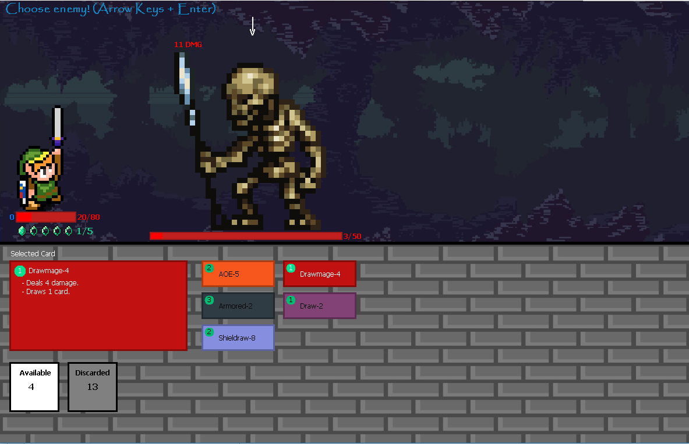
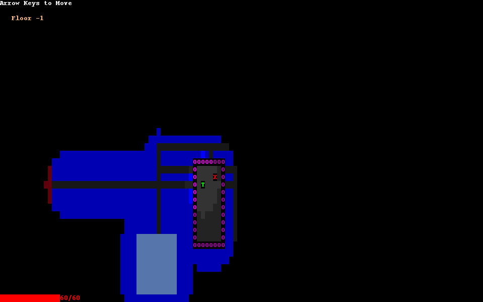
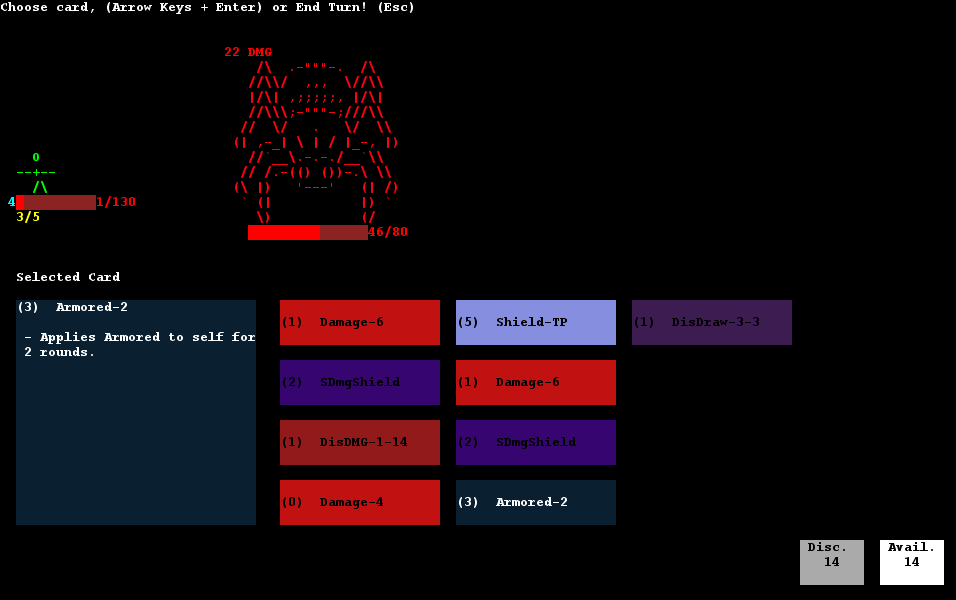

# LPOO_77 Slay The Spider

The project is a **text-based game**, based on [Slay the Spire](https://en.wikipedia.org/wiki/Slay_the_Spire), a [roguelike](https://en.wikipedia.org/wiki/Roguelike) / [deck-building](https://en.wikipedia.org/wiki/Deck-building_game) card game.

The main goal of the game is to use your cards to defeat all the enemies from increasingly harder procedurally-generated dungeons and face each final boss before progressing to the next level, as you collect more and stronger cards along the way. 

This project was developed by *Pedro Moás* (up201705208@fe.up.pt) and *Daniel Brandão* (up201705812@fe.up.pt), for LPOO 2018/19.

## Screenshots

#### Adventurous explorer embarking on a journey

#### Hero slays another monster

#### Reward Screen (after defeating an encounter)

## Screenshots (w/ Lanterna)

### Overworld

### Poor player is about to get slaughtered by the final boss

## Install Instructions

Execute SlayTheSpider.jar.
