# LPOO_77 Slay the Spider

The project is a **text-based game**, based on [Slay the Spire](https://en.wikipedia.org/wiki/Slay_the_Spire), a [roguelike](https://en.wikipedia.org/wiki/Roguelike) / [deck-building](https://en.wikipedia.org/wiki/Deck-building_game) card game.

The main goal of the game is to use your cards to defeat all the enemies from increasingly harder procedurally-generated dungeons and face each boss before progressing to the next level, as you collect more and stronger cards along the way. 

Slay the final boss, on the -3rd Floor, for a satisfying victory!

This project was developed by *Pedro Moás* (up201705208@fe.up.pt) and *Daniel Brandão* (up201705812@fe.up.pt), for LPOO 2018/19.

---

## Implemented Features

The game implements various features, such as:

- **Procedurally-generated levels**, containing different types of rooms (Spawn, Enemy, Boss), allowing the player to move around them through randomized hallways.
- **Multiple floors**, each one harder than the previous. The final boss is located at the Floor -3.
- **Randomized fights**: Each enemy room will contain 1+ fights scattered around, randomly selected from a supplied pool. The player will not be able to leave the room until he has defeated all the enemies inside.
- **Unique encounters**: The player may need to defeat more than one enemy during a fight, therefore each one will have its own health and damage. Also, the enemies go stronger as the fight progresses.
- **Fight rewards**: After each fight, the player will be able to acquire cards, and even a maximum health boost.
- **Various resources**: During a battle, you must always be aware of your resources. Your enemies take **health** from you, but you also protect yourself with certain cards, which might give you health or **shield**, which is similar in a way, but it does not have a limit. However, you must always pay attention to your **mana**, since most cards will cost you some of it.
- **Unique cards**: Each card will have its own group of effects and some may target more than one character. Card effects include damage, shield, heal, mana restoration, status effects, life drain, Area of Effect attacks, card drawing, shuffling and many more. Card effects may even be associated with a condition, e.g. "Enemy is at less than X% HP" or "User has over Y cards in his hand", which allows for thousands of card possibilities.
- **Various Status Effects**, such as *Stunned*, which will prevent a character from damaging another, *Weak*, which will reduce a character's damage by 50%, or *Armored*, which will reduce the damage you receive.
- **Two interfaces**: Same game, another style. The main menu allows you to switch to a less modern interface.

### **Screenshots**

#### Adventurous explorer embarking on a journey

#### A challenger approaches!

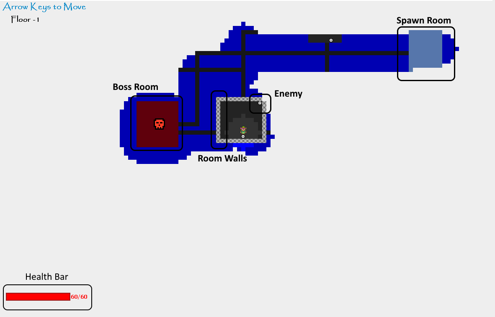

#### An encounter example

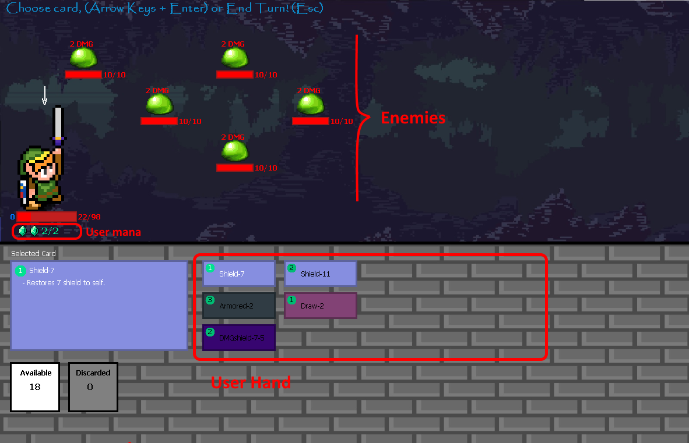

#### Hero slays another monster

#### Reward Screen (after defeating an encounter)

### **Screenshots (Lanterna)**

#### Overworld

#### Encounter

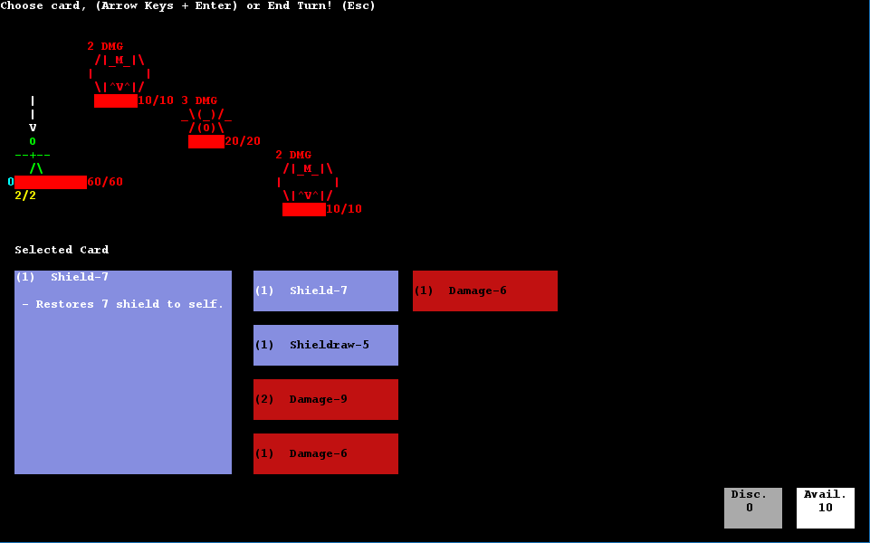

#### Poor player is about to get slaughtered by the final boss

---

## Planned Features

- **Shop Room and gold currency**: Each level will contain a shop room, which contains no enemies, but a shopkeeper, which allows you to spend the gold you've acquired so far in order to buy some cards for your deck.
- **Enemy status attacks:** An enemy could have a small chance to inflict a status effect.
- **More cards:** Because it never hurts to have new card effects.

### **Screenshots**

#### Shop Room (w/ gold) GUI MockUp

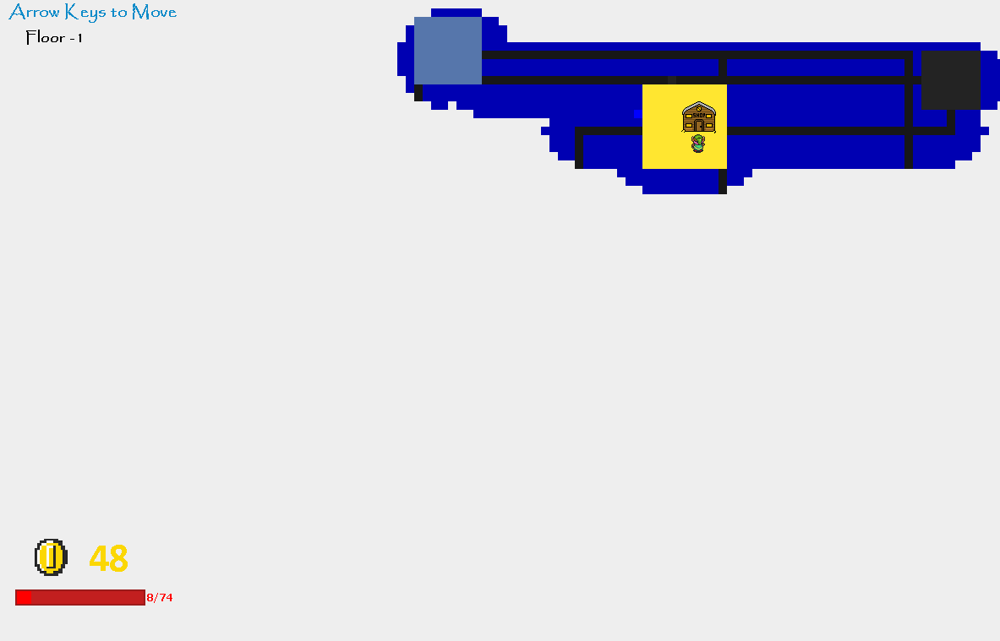

---

## Design

### Note: Changes since Project Demo

- Split MVC in 4, like explained below
- Several interface improvements
- Fixed thread concurrency crashes
- Added possibility to change between Swing and Lanterna in the main menu

### **Game architecture**

#### Problem in context

During project development, the most important aspect to take care of was how the whole game's architecture would be designed, in order to process user input and display the game data in a structured way. The naive solution would be to let the game know how to draw itself, and process user input in the same place. However, that would couple the processing of the user input, the game drawing and the actual information altogether, allowing for little extensibility.

#### The Pattern

We have applied the **MVC** pattern. This divides the application into three parts:

- The **Model**, which represents the actual game data
- The **View**, which displays the data from the model
- The **Controller**, which provides the model data to the view, and processes user actions.

However, a game has different game states, and depending on if the player is selecting a reward, fighting a monster or travelling around the overworld, the **View** should display the model in a different way, and each key press should be interpreted in a different way by the **Controller**, which becomes another problem, since using a switch statement and enums to check which game state we're currently on can be a bad thing since it's not so extensible.

That way, we implemented **4** MVCs, each representing one Game State: Main Menu, Overworld, Fighting, Rewards. The Class [**SuperController**](https://github.com/FEUP-LPOO/projecto-lpoo-2019-lpoo_77/blob/ab9ab4ef78ca0af50c9b17c2f311553ee919857d/LPOO-proj/src/main/java/SuperController.java) effectively runs the game and has the job of telling the current controller what it should do. As the specification required the game to be playable using two different GUI tools, each View will have two implementation, one for Lanterna and one for Swing (more on that later).

#### Implementation

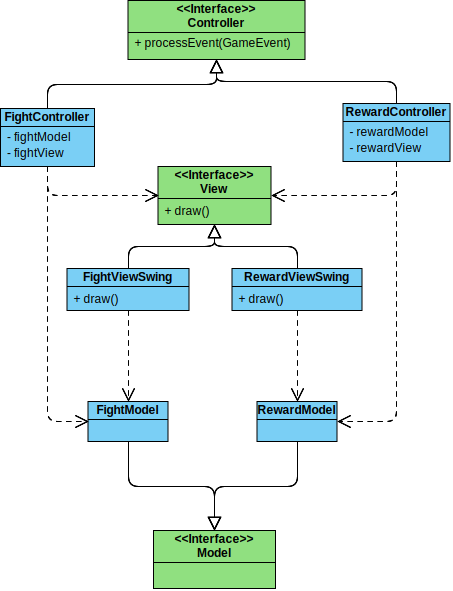

To simplify the diagram, only two MVCs were shown, and each with one View.
These classes can be found on the folowing files:

- [Model](https://github.com/FEUP-LPOO/projecto-lpoo-2019-lpoo_77/blob/master/LPOO-proj/src/main/java/SlayTheSpider/Model/Model.java)
- [View](https://github.com/FEUP-LPOO/projecto-lpoo-2019-lpoo_77/blob/master/LPOO-proj/src/main/java/SlayTheSpider/View/View.java)
- [Controller](https://github.com/FEUP-LPOO/projecto-lpoo-2019-lpoo_77/blob/master/LPOO-proj/src/main/java/SlayTheSpider/Controller/Controller.java)
- [FightModel](https://github.com/FEUP-LPOO/projecto-lpoo-2019-lpoo_77/blob/master/LPOO-proj/src/main/java/SlayTheSpider/Model/FightModel.java)
- [RewardModel](https://github.com/FEUP-LPOO/projecto-lpoo-2019-lpoo_77/blob/master/LPOO-proj/src/main/java/SlayTheSpider/Model/RewardModel.java)
- [FightViewSwing](https://github.com/FEUP-LPOO/projecto-lpoo-2019-lpoo_77/blob/master/LPOO-proj/src/main/java/SlayTheSpider/View/FightViewSwing.java)
- [RewardViewSwing](https://github.com/FEUP-LPOO/projecto-lpoo-2019-lpoo_77/blob/master/LPOO-proj/src/main/java/SlayTheSpider/View/RewardViewSwing.java)
- [FightController](https://github.com/FEUP-LPOO/projecto-lpoo-2019-lpoo_77/blob/master/LPOO-proj/src/main/java/SlayTheSpider/Controller/FightController.java)
- [RewardController](https://github.com/FEUP-LPOO/projecto-lpoo-2019-lpoo_77/blob/master/LPOO-proj/src/main/java/SlayTheSpider/Controller/RewardController.java)

#### Consequences

- Separation of Concerns: Each component has one specific job, instead of having one class that does it all
- New game states can be added, by creating new MVCs without modifying the existing ones.
- The number of classes is much higher with multiple MVCs, although still maintainable.

### **The processing of user input while fighting**

#### Problem in context

When a player is fighting, each key press might need to call a different function, as the player may be choosing his card, selecting an enemy, or waiting for the opponent to attack. The naive solution would be to create an enum with each state, and upon a key press, a switch statement would decide which functions to call. However, that would be a violation of the **Single Responsability Principle**, since a class would be taking care of all the possible states, but more importantly, of the **Open/Closed Principle**, since adding a new state would mean looking at the entire class and modifying it.

#### The Pattern

To solve the issue, we've applied the **State** pattern. This pattern uses subclasses to represent each different state. We can switch to a different state by switching to another subclass. That way, the arised problems have been fixed, as adding a new state would just require a new class creation. This way, we can let the **Game** class have its **GameState** and by calling the state's functions they'll be able to update the Game accordingly. This is almost equivalent to adding a new controller for every state, although slightly less complicated.

#### Implementation

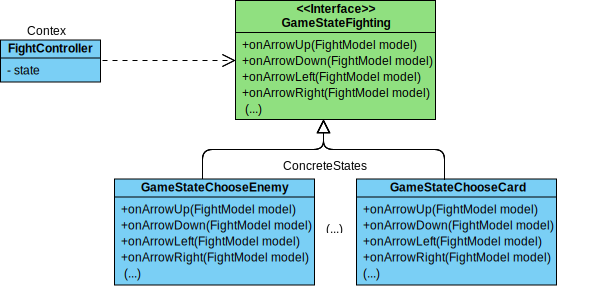

These classes can be found in the following files:

- [FightController](https://github.com/FEUP-LPOO/projecto-lpoo-2019-lpoo_77/blob/master/LPOO-proj/src/main/java/SlayTheSpider/Controller/FightController.java)
- [GameStateFighting](https://github.com/FEUP-LPOO/projecto-lpoo-2019-lpoo_77/blob/master/LPOO-proj/src/main/java/SlayTheSpider/Controller/FightStates/GameStateFighting.java)
- [GameStateChooseCard](https://github.com/FEUP-LPOO/projecto-lpoo-2019-lpoo_77/blob/master/LPOO-proj/src/main/java/SlayTheSpider/Controller/FightStates/GameStateChooseCard.java)
- [GameStateChooseEnemy](https://github.com/FEUP-LPOO/projecto-lpoo-2019-lpoo_77/blob/master/LPOO-proj/src/main/java/SlayTheSpider/Controller/FightStates/GameStateChooseEnemy.java)

#### Consequences

- The several states of the fight become explicit in the code, instead of relying on a series of flags.
- We don’t need to have a long set of conditional if or switch statements for each state. Instead, polymorphism is used to trigger the correct actions.
- The number of classes did not increase by a lot

### **The creation of a character Health Bar**

#### Problem in context

For our fights, we knew that it was important to have a class that managed the player/enemy resources. However, since players and enemies do not possess the same fields (enemies don't use shield or mana), there had to be two different subclasses for that (**PlayerHealthBar** and **EnemyHealthBar**).

The problem appeared when we wanted to make a **Character** constructor. A character always has a **HealthBar**, but its type depends on the subclass that would be instantiated (**Player** or **Enemy**). 

A naive solution would be to push down the superclass constructor, changing the healthbar type on each subclass, but duplicate code is always hard to maintain and indicates bad design.

#### The Pattern

We have applied the **Factory Method** pattern. The **Character** class creates the common fields, but the subclasses choose which **HealthBar** implementation to instantiate.

#### Implementation

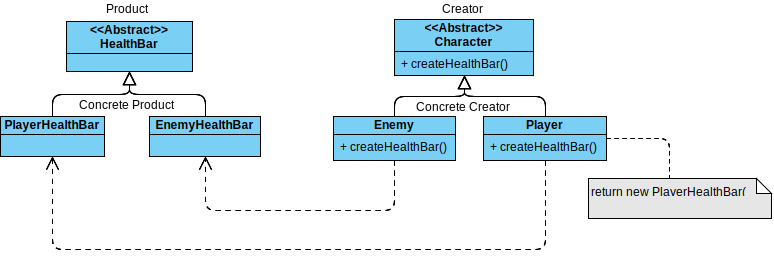

These classes can be found in the following files:

- [Character](https://github.com/FEUP-LPOO/projecto-lpoo-2019-lpoo_77/blob/master/LPOO-proj/src/main/java/SlayTheSpider/Model/Game/Character.java)
- [Player](https://github.com/FEUP-LPOO/projecto-lpoo-2019-lpoo_77/blob/master/LPOO-proj/src/main/java/SlayTheSpider/Model/Game/Player.java)
- [Enemy](https://github.com/FEUP-LPOO/projecto-lpoo-2019-lpoo_77/blob/master/LPOO-proj/src/main/java/SlayTheSpider/Model/Game/Enemy.java)
- [HealthBar](https://github.com/FEUP-LPOO/projecto-lpoo-2019-lpoo_77/blob/master/LPOO-proj/src/main/java/SlayTheSpider/Model/Game/HealthBar/HealthBar.java)
- [PlayerHealthBar](https://github.com/FEUP-LPOO/projecto-lpoo-2019-lpoo_77/blob/master/LPOO-proj/src/main/java/SlayTheSpider/Model/Game/HealthBar/PlayerHealthBar.java)
- [EnemyHealthBar](https://github.com/FEUP-LPOO/projecto-lpoo-2019-lpoo_77/blob/master/LPOO-proj/src/main/java/SlayTheSpider/Model/Game/HealthBar/EnemyHealthBar.java)

#### Consequences

- **No more duplicate code**, which means better readability and maintainability.
- Although it probably will not be needed, an extra **Character** type could be easily added and have a different **HealthBar** implementation

### **Implementation of Menu options**

#### Problem in context

For the game to have a great UX, the User Interface must be intuitive, and at certain times there must exist menus that allow for the user to select between a range of options.
Since each option will probably do a very different operation, we needed to find a way to structure the code that didn't involve nested ifs and switch operations with a method for each possible selection, as that would violate the **Single Responsibility Principle** and the **Open/Closed Principle**, as seen before.

#### The Pattern

We have applied the **Command** pattern. A **Menu** is composed by several menu items, a **MenuItem** can aggregate several implementations of **MenuCommand**, and each one of them knows how to execute their operation.

#### Implementation

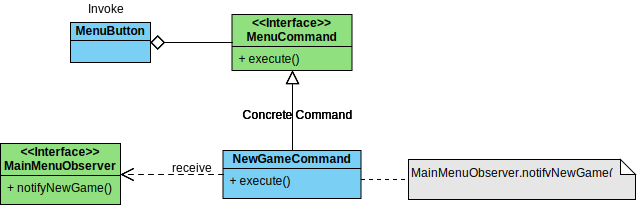

These classes can be found in the following files:

- [MenuButton](https://github.com/FEUP-LPOO/projecto-lpoo-2019-lpoo_77/blob/master/LPOO-proj/src/main/java/SlayTheSpider/Model/Menus/MenuButton.java)
- [MenuCommand](https://github.com/FEUP-LPOO/projecto-lpoo-2019-lpoo_77/blob/master/LPOO-proj/src/main/java/SlayTheSpider/Model/Menus/MenuCommand.java)
- [NewGameCommand](https://github.com/FEUP-LPOO/projecto-lpoo-2019-lpoo_77/blob/master/LPOO-proj/src/main/java/SlayTheSpider/Model/Game/MainMenu/MainMenuCommands/NewGameCommand.java)
- [MainMenuObserver](https://github.com/FEUP-LPOO/projecto-lpoo-2019-lpoo_77/blob/master/LPOO-proj/src/main/java/SlayTheSpider/Model/Game/MainMenu/MainMenuCommands/MainMenuObserver.java)

#### Consequences

- Existing Menu commands can be easily extended or new ones added
- Separates the invoker of the menu operation from the object that knows how to perform it.

### **Notifying the Controller of the Menu's actions**

#### Problem in context

When implementing the **MainMenu** commands, we realised that a command should be able to make the game start, end or do something else, depending on the chosen option. A possible solution would be to pass the **Game** object to the commands, so that they could access and modify its fields. However, that would be a violation of the **Interface Segregation Principle**, as the **MainMenu** should definitely not be allowed to access the entirety of the game's methods.

#### The Pattern

We have applied the **Observer** pattern. Each **MainMenuCommand** must be associated with a **MainMenuObserver**, and its implementations should always know how to react upon a notification from each command. That way, we can set the **Game** class as a **MainMenuObserver** implementation.

#### Implementation

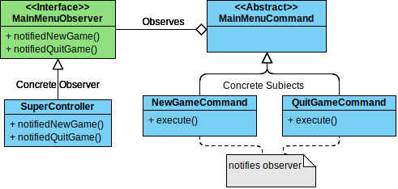

These classes can be found in the following files:

- [SuperController](https://github.com/FEUP-LPOO/projecto-lpoo-2019-lpoo_77/blob/master/LPOO-proj/src/main/java/SlayTheSpider/SuperController.java)
- [MainMenuObserver](https://github.com/FEUP-LPOO/projecto-lpoo-2019-lpoo_77/blob/master/LPOO-proj/src/main/java/SlayTheSpider/Model/Game/MainMenu/MainMenuCommands/MainMenuObserver.java)
- [MainMenuCommand](https://github.com/FEUP-LPOO/projecto-lpoo-2019-lpoo_77/blob/master/LPOO-proj/src/main/java/SlayTheSpider/Model/Game/MainMenu/MainMenuCommands/MainMenuCommand.java)
- [NewGameCommand](https://github.com/FEUP-LPOO/projecto-lpoo-2019-lpoo_77/blob/master/LPOO-proj/src/main/java/SlayTheSpider/Model/Game/MainMenu/MainMenuCommands/NewGameCommand.java)
- [QuitGameCommand](https://github.com/FEUP-LPOO/projecto-lpoo-2019-lpoo_77/blob/master/LPOO-proj/src/main/java/SlayTheSpider/Model/Game/MainMenu/MainMenuCommands/QuitGameCommand.java)

#### Consequences

- **MainMenu** no longer depends on **SuperController**, but both on interfaces.
- Not a huge improvement if several types of notifications are needed, since a method would be required for all of them, but it is not the case.

### **Action for Empty menu**

#### Problem in context

If, by any chance, an Empty menu is created, the program should not crash. However, when the user presses enter, the currently selected MenuItem will be **null**. Therefore, an `if (menuButton == null)` check must be made in order to avoid a **NullPointerException**. That does not heavily break any of the **SOLID Principles** but is generally considered a **code smell**.

#### The Pattern

We have applied the **Null Object** pattern. In the eventual case that a Menu is empty, and thus no button can be selected, a **NullMenuButton** instance is returned, which takes no action when its `void click()` method is called.

#### Implementation

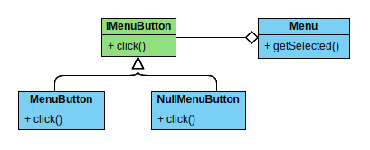

These classes can be found in the following files:

- [Menu](https://github.com/FEUP-LPOO/projecto-lpoo-2019-lpoo_77/blob/master/LPOO-proj/src/main/java/SlayTheSpider/Model/Menus/Menu.java)
- [IMenuButton](https://github.com/FEUP-LPOO/projecto-lpoo-2019-lpoo_77/blob/master/LPOO-proj/src/main/java/SlayTheSpider/Model/Menus/IMenuButton.java)
- [MenuButton](https://github.com/FEUP-LPOO/projecto-lpoo-2019-lpoo_77/blob/master/LPOO-proj/src/main/java/SlayTheSpider/Model/Menus/MenuButton.java)
- [NullMenuButton](https://github.com/FEUP-LPOO/projecto-lpoo-2019-lpoo_77/blob/master/LPOO-proj/src/main/java/SlayTheSpider/Model/Menus/NullMenuButton.java)

#### Consequences

- The MenuItem value will not need to be checked for a **null** value.

### **Circular List implementation**

#### Problem in context

At several moments of the project's development, we needed a List implementation that allowed to save the currently selected item, as well as cycle through it like a circular list. For instance, a player must be able to go through each card and select it, the same for each enemy he's currently fighting, and for the available menu options, in case there's one open. However, Java's List interface does not support such specific operations.

#### The Pattern

We have applied the **Adapter** pattern. By creating a new class **ListCycler<T>**, we could create an implementation of it called **ArrayListCycler<T>**, which is composed by a **List<T>**. That way, the desired functionalities can be implemented on it, by manipulating the object's list.

#### Implementation

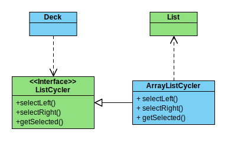

These classes can be found in the following files:

- [Deck](https://github.com/FEUP-LPOO/projecto-lpoo-2019-lpoo_77/blob/master/LPOO-proj/src/main/java/SlayTheSpider/Model/Game/Deck.java)
- [ListCycler](https://github.com/FEUP-LPOO/projecto-lpoo-2019-lpoo_77/blob/master/LPOO-proj/src/main/java/SlayTheSpider/Model/ListCycler/ListCycler.java)
- [ArrayListCycler](https://github.com/FEUP-LPOO/projecto-lpoo-2019-lpoo_77/blob/master/LPOO-proj/src/main/java/SlayTheSpider/Model/ListCycler/ArrayListCycler.java)

#### Consequences

- Easy to add/alter functionalities
- Easy to test
- It's not the game's job to manage the cycling through the list

### **Implementation of multiple views**

#### Problem in context

As the project specification demanded the game should be able to work with any view, we needed to find a structure that allowed us to add a new way of displaying the game just by creating its different Views, without interfering with the game's logic/model. The problem would then be to find a way to change the view by editing a single class/line, not all of the drawer classes.

#### The Pattern

We have applied the **Abstract Factory** pattern. By creating an interface called **ViewFactory** we can have each of the factory's implementation decide which objects it will create. **LanternaFactory** will create Views that use the Lanterna framework, whereas **SwingFactory** will create Views that use the Swing framework.

#### Implementation

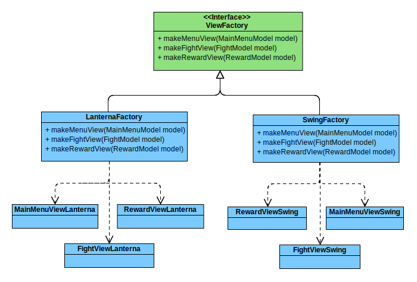

These classes can be found in the following files:

- [ViewFactory](https://github.com/FEUP-LPOO/projecto-lpoo-2019-lpoo_77/blob/master/LPOO-proj/src/main/java/SlayTheSpider/View/ViewFactory.java)
- [LanternaFactory](https://github.com/FEUP-LPOO/projecto-lpoo-2019-lpoo_77/blob/master/LPOO-proj/src/main/java/SlayTheSpider/Factory/LanternaFactory.java)
- [MainMenuViewLanterna](https://github.com/FEUP-LPOO/projecto-lpoo-2019-lpoo_77/blob/master/LPOO-proj/src/main/java/SlayTheSpider/View/MainMenuViewLanterna.java)
- [FightViewLanterna](https://github.com/FEUP-LPOO/projecto-lpoo-2019-lpoo_77/blob/master/LPOO-proj/src/main/java/SlayTheSpider/View/FightViewLanterna.java)
- [RewardViewLanterna](https://github.com/FEUP-LPOO/projecto-lpoo-2019-lpoo_77/blob/master/LPOO-proj/src/main/java/SlayTheSpider/View/RewardViewLanterna.java)
- [SwingFactory](https://github.com/FEUP-LPOO/projecto-lpoo-2019-lpoo_77/blob/master/LPOO-proj/src/main/java/SlayTheSpider/Factory/SwingFactory.java)
- [MainMenuViewSwing](https://github.com/FEUP-LPOO/projecto-lpoo-2019-lpoo_77/blob/master/LPOO-proj/src/main/java/SlayTheSpider/View/MainMenuViewSwing.java)
- [FightViewSwing](https://github.com/FEUP-LPOO/projecto-lpoo-2019-lpoo_77/blob/master/LPOO-proj/src/main/java/SlayTheSpider/View/FightViewSwing.java)
- [RewardViewSwing](https://github.com/FEUP-LPOO/projecto-lpoo-2019-lpoo_77/blob/master/LPOO-proj/src/main/java/SlayTheSpider/View/RewardViewSwing.java)

#### Consequences

- Easier to add more views, and each can have their way to drawing the game's components.
- The chosen drawing framework can be changed by simply editing the used Factory implementation.

### **Implementing tile visibility status**

#### Problem in context

In order to have a more natural experience, we decided that the player should not be able to see the entire map as soon as he spawns. Instead, he would have a view range limit (currently 4 squares) and reveal the map as he explored it. For that, each map tile needs to store its current state: (*VisibleFar*, *VisibleNear* or *Invisible*), and depending on its status and the player's position, it must know how to update its visibility. However, using a switch-case could be considered a code smell, and choosing which action to take on the same class/method would be a violation of the **Open/Closed Principle**.

#### Pattern

We've applied the **State** pattern. As explained before, this pattern uses subclasses to represent each different state, and we can switch to a different state by internally switching to another subclass. Each **OverworldElement** (that means **Tile**, **OverworldWall**, **OverworldEnemy**) has an **ElementVisibility**, and by calling its update method, its state will know whether or not to update itself to a different subclass. That way, the actions taken will depend on the respective state class, and a switch-case is no longer needed.

#### Implementation

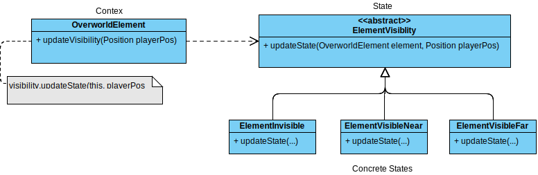

These classes can be found in the following files:

- [OverworldElement](https://github.com/FEUP-LPOO/projecto-lpoo-2019-lpoo_77/blob/master/LPOO-proj/src/main/java/SlayTheSpider/Model/Game/Overworld/OverWorldElements/OverworldElement.java)
- [ElementVisibility](https://github.com/FEUP-LPOO/projecto-lpoo-2019-lpoo_77/blob/master/LPOO-proj/src/main/java/SlayTheSpider/Model/Game/Overworld/OverWorldElements/Visibility/ElementVisibility.java)
- [ElementInvisible](https://github.com/FEUP-LPOO/projecto-lpoo-2019-lpoo_77/blob/master/LPOO-proj/src/main/java/SlayTheSpider/Model/Game/Overworld/OverWorldElements/Visibility/ElementInvisible.java)
- [ElementVisibleFar](https://github.com/FEUP-LPOO/projecto-lpoo-2019-lpoo_77/blob/master/LPOO-proj/src/main/java/SlayTheSpider/Model/Game/Overworld/OverWorldElements/Visibility/ElementVisibleFar.java)
- [ElementVisibleNear](https://github.com/FEUP-LPOO/projecto-lpoo-2019-lpoo_77/blob/master/LPOO-proj/src/main/java/SlayTheSpider/Model/Game/Overworld/OverWorldElements/Visibility/ElementVisibleNear.java)

#### Consequences

- The several tile states become explicit in the code, instead of relying on a switch-case, as polymorphism is used to trigger the correct actions.
- New states can be easily added, in which case only one function needs to be implemented
- The number of classes did not increase much, which allows the code to stay readable and maintainable

### **Implementing room status**

#### Problem in context

As a mechanic of our game, we decided that, upon entering an enemy room, the player should be blocked from leaving until he had cleared all of the enemies within, therefore we had wall objects created for it. However, it would make no sense for a visited room to check whether or not a player is inside it, or to build walls over walls, so we had to keep an indicator of the three possibilities of the room's status: *RoomFighting*, *RoomVisited*, *RoomVisited*. As it was mentioned above, having a switch-case / if clauses would not be a clean way to handle such a case.

#### Pattern

As would be expected, we have applied the **State** pattern. Once more, the pattern takes advantage of subclasses to be able to choose between several possible states and, usually, a class delegates the decision of which action to take to its state, letting it "change" its class if needed. Each **EnemyRoom** contains an **EnemyRoomStatus** (extended by **RoomFighting**, **RoomVisited** and **RoomNotVisited**). When its status must be updated, a function is called to the room's state, and each implementation will decide what it should do. As explained several times, this removes the need for the switch/if statements.

#### Implementation

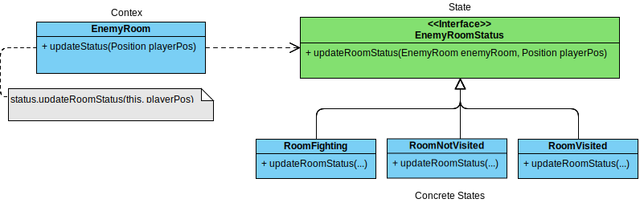

These classes can be found in the following files:

- [EnemyRoom](https://github.com/FEUP-LPOO/projecto-lpoo-2019-lpoo_77/blob/master/LPOO-proj/src/main/java/SlayTheSpider/Model/Game/Overworld/Rooms/EnemyRoom.java#L123-L125)
- [EnemyRoomStatus](https://github.com/FEUP-LPOO/projecto-lpoo-2019-lpoo_77/blob/master/LPOO-proj/src/main/java/SlayTheSpider/Model/Game/Overworld/Rooms/RoomStatus/EnemyRoomStatus.java)
- [RoomFighting](https://github.com/FEUP-LPOO/projecto-lpoo-2019-lpoo_77/blob/master/LPOO-proj/src/main/java/SlayTheSpider/Model/Game/Overworld/Rooms/RoomStatus/RoomFighting.java)
- [RoomNotVisited](https://github.com/FEUP-LPOO/projecto-lpoo-2019-lpoo_77/blob/master/LPOO-proj/src/main/java/SlayTheSpider/Model/Game/Overworld/Rooms/RoomStatus/RoomNotVisited.java)
- [RoomVisited](https://github.com/FEUP-LPOO/projecto-lpoo-2019-lpoo_77/blob/master/LPOO-proj/src/main/java/SlayTheSpider/Model/Game/Overworld/Rooms/RoomStatus/RoomVisited.java)

#### Consequences

- The same consequences mentioned in the previous state pattern usages, that is, the fact that a switch-case statement is not needed, due to the fact that polymorphism will instead take care of the decisions.
- New room states can be added without modifying the existing code, or creating a huge mess.
- The number of classes did not increase much, which allows the code to stay readable and maintainable

---

### **Development of card effects**

#### Problem in context

Perhaps the trickiest problem we faced during development was deciding how a Card object would behave. We knew we wanted the cards to do all sorts of things, either draw a card, heal the player, attack an enemy or maybe even do all of them. One option would be to design each card as a different class, which would not be so bad from a quick glance, assuming the parameters would be passable in the constructor, for instance. However, that approach would most definitely not work if we ever tried to make cards that do more than one "thing", such as "Deal X damage and draw 3 cards". That could easily escalate to hundreds of card classes without adding too many possibilities. Besides that, any class that combined the effects of two other cards would most likely be duplicating both of their codes, another horrible thing to do. 

Another issue we had was, not only could two different cards have two different effects, but they could also target characters differently (for instance, target the player, target an enemy, target all of the enemies, etc), so we needed to make sure that part was not repeated as well.

To top it all of, we finally wanted cards to have the possiblity of doing something **if** some sort of condition verified (e.g, "If monster is at 50% health or less, deal double damage."). That way, having a class per card might  reach thousands of files, if we wanted to get creative, and that feels simply unnecessary.

#### Pattern

We have applied the **Strategy** pattern. The devised solution was not far from the previous one, but instead of Cards themselves implementing or inheriting their abilities, they use **Composition** to achieve the desired goal. Each Card contains a List of **CardEffects**. Upon use, the card simply executes its effects, and it's up to them to implement them. That way, we can create **DamageEffect**,  **SelfDrawCardEffect**, and **SelfHealEffect** classes, and then every card can utilize any combination of those effects, without reimplementing that code. 

With that solved, we can fix the targeting issue described above by creating three intermediate abstract classes: **CardEffectSelf**, **CardEffectSingle**, **CardEffectAoE**, that would implement the targeting system, and demand their subclasses to implement how the effect would behave for a single target. 

That way, we can have a card holding any number of card effects with all sorts of abilities and target types. A card might even use an effect on the player, another on an enemy and another on all of the opponents.

The described approach is extremely similar to the one we used to apply **Conditions** to the card effects themselves. By **Composition** the effects possess a group of **CardEffectConditions**, and each simply demands an implementation
of a `verify()` function, to assess whether or not the condition is met. Before executing, a card effect will verify if all the conditions verify, otherwise the effect will not be applied (And given the intent, this seemed the most suited place for an if statement).

#### Implementation

For simplification, only a couple of effects and conditions were shown.

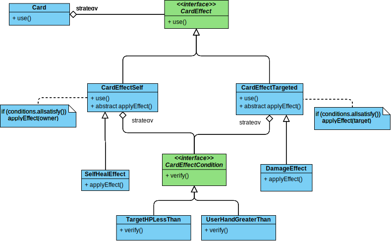

These classes can be found in the following files:

- [Card](https://github.com/FEUP-LPOO/projecto-lpoo-2019-lpoo_77/blob/master/LPOO-proj/src/main/java/SlayTheSpider/Model/Game/Card.java)
- [CardEffect](https://github.com/FEUP-LPOO/projecto-lpoo-2019-lpoo_77/blob/master/LPOO-proj/src/main/java/SlayTheSpider/Model/Game/CardEffect/CardEffect.java)
- [CardEffectSelf](https://github.com/FEUP-LPOO/projecto-lpoo-2019-lpoo_77/blob/master/LPOO-proj/src/main/java/SlayTheSpider/Model/Game/CardEffect/CardEffectSelf.java)
- [CardEffectTargeted](https://github.com/FEUP-LPOO/projecto-lpoo-2019-lpoo_77/blob/master/LPOO-proj/src/main/java/SlayTheSpider/Model/Game/CardEffect/CardEffectTargeted.java)
- [DamageEffect](https://github.com/FEUP-LPOO/projecto-lpoo-2019-lpoo_77/blob/master/LPOO-proj/src/main/java/SlayTheSpider/Model/Game/CardEffect/DamageEffect.java)
- [SelfHealEffect](https://github.com/FEUP-LPOO/projecto-lpoo-2019-lpoo_77/blob/master/LPOO-proj/src/main/java/SlayTheSpider/Model/Game/CardEffect/SelfHealEffect.java)
- [CardEffectCondition](https://github.com/FEUP-LPOO/projecto-lpoo-2019-lpoo_77/blob/master/LPOO-proj/src/main/java/SlayTheSpider/Model/Game/CardEffect/Conditions/CardEffectCondition.java)
- [TargetHPLessThan](https://github.com/FEUP-LPOO/projecto-lpoo-2019-lpoo_77/blob/master/LPOO-proj/src/main/java/SlayTheSpider/Model/Game/CardEffect/Conditions/TargetHPLessThan.java)
- [UserHandGreaterThan](https://github.com/FEUP-LPOO/projecto-lpoo-2019-lpoo_77/blob/master/LPOO-proj/src/main/java/SlayTheSpider/Model/Game/CardEffect/Conditions/UserHandGreaterThan.java)

#### Consequences

- No conditional statements needed to know what to do on each card
- The combination of any number of different effects becomes possible, allowing for loads of card design options, without having an absurd number of classes.
- The system is very easy to extend, only needs a class and one method definition in it.
- Although the way the targeting system was devised might, on some cases, originate some very similar functions (e.g. **SelfDamageEffect** and **DamageEffect**), not only will very few of them overlap, but also the repeated code is usually in a very small amount (~1 line), which is completely justified by the huge amount of code duplication that was avoided.

## Known Code Smells and Refactoring Suggestions

### **Long Parameter List**

The Class [**Enemy**](https://github.com/FEUP-LPOO/projecto-lpoo-2019-lpoo_77/blob/master/LPOO-proj/src/main/java/SlayTheSpider/Model/Game/Enemy.java) contains a **Long Parameter List**. [One of the constructors](https://github.com/FEUP-LPOO/projecto-lpoo-2019-lpoo_77/blob/master/LPOO-proj/src/main/java/SlayTheSpider/Model/Game/Enemy#L20.java) method contains too many parameters of code, which hampers readability. 

A way to improve the code would be to group the damage and damageScale parameters into one object.

### **Large Class**

The class [**EnemyRoom**](https://github.com/FEUP-LPOO/projecto-lpoo-2019-lpoo_77/blob/master/LPOO-proj/src/main/java/SlayTheSpider/Model/Game/Overworld/Rooms/EnemyRoom.java) is a **Large Class**, since it contains a lot of methods inside it. This is usually considered a code smell, as in most cases it can be separated in several, smaller classes, and instead is ruining the code's readability.

A way to improve the code would be to reduce the number of methods by, for instance, using another class for managing the wall placement, applying **Move Method** on the `buildWalls`, `clearWalls()` and `getWalls()` methods. Removing the `noEnemies()` method would also help, and it's not really necessary as there's already a function that returns the room's enemy list.

### **Message chains**

Classes such as [**TurnCardsToDamageEffect**](https://github.com/FEUP-LPOO/projecto-lpoo-2019-lpoo_77/blob/master/LPOO-proj/src/main/java/SlayTheSpider/Logic/GameLogic/CardEffect/TurnCardsToDamageEffect.java), [**TurnCardsToShieldEffect**](https://github.com/FEUP-LPOO/projecto-lpoo-2019-lpoo_77/blob/master/LPOO-proj/src/main/java/SlayTheSpider/Logic/GameLogic/CardEffect/TurnCardsToShieldEffect.java) and [**TurnCardsToHealthEffect**](https://github.com/FEUP-LPOO/projecto-lpoo-2019-lpoo_77/blob/master/LPOO-proj/src/main/java/SlayTheSpider/Logic/GameLogic/CardEffect/TurnCardsToDamageEffect.java) are examples of classes that utilize **Message Chains** on some method. The player object asks for the stats object, which then asks for another object, which finally asks for a value. This makes the class dependant on the navigation structure, which means a change to any intermediate relationship would force the class to change.
Besides that, it makes the class a lot harder to test, as a mock is needed for each message.

A possible solution would be to apply a **Hide delegate**, so that the player class will instead return the required values. However, since many of those alterations would be required, we would end up having a **Large Class** and a **Middle Man**, possibly making the code even more confusing.

---

## Testing Results

- Main results:

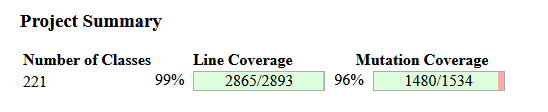

- [Reports](test-results/links/index.html)

---

## Self-evaluation

- Daniel Brandão: 50%
- Pedro Moás: 50%
